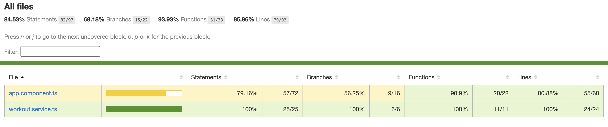

# Project Title
HEALTH TRACKER 
## Description
This project is a workout tracking application developed using Angular. It provides features for managing user workouts, tracking progress, and visualizing data with charts. The app utilizes localStorage to persist workout data, ensuring users can retain their information even after closing the application.

## Features
- User management and selection
- Workout tracking and progress visualization
- LocalStorage integration for data persistence
- Error handling for corrupted or invalid data in localStorage
- Responsive design for various screen sizes

## Technologies Used
- Angular
- Jasmine (for testing)
- Karma (test runner)
- Zone.js (for asynchronous testing)

## Installation
1. Clone the repository:
   ```bash
   git clone https://github.com/amanreddy77/health_tracker.git
   ```
2. Navigate to the project directory:
   ```bash
   cd workout-tracker
   ```
3. Install dependencies:
   ```bash
   npm install
   ```
4. Run the application:
   ```bash
   ng serve
   ```

## Running Tests
To execute the unit tests, run:
```bash
ng test
```

## Code Coverage Report

=============================== Coverage summary ===============================



## Troubleshooting
- Ensure localStorage data is valid JSON to prevent parsing errors.
- Clear localStorage before running tests to avoid conflicts with existing spies.
- Use `.toEqual()` instead of `.toBe()` when checking for deep equality in tests.


## License
This project is licensed under the MIT License.

## Contact
For any inquiries, please contact [reddyaman77.ar@gmail.com].

